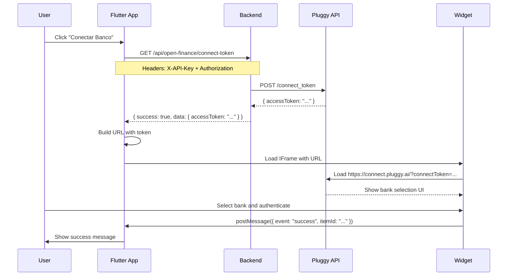

# 🔧 Troubleshooting - Pluggy Connect Integration

## 🚨 Erro Atual

**Mensagem do Pluggy:**
```
Ops! Parece que você esqueceu de incluir o seu Connect Token ao iniciar o Pluggy Connect.
```

## 📊 Status Atual

### Backend ✅
- ✅ Servidor rodando em `http://localhost:3000`
- ✅ Endpoint `/api/open-finance/connect-token` disponível
- ✅ Middleware de autenticação configurado

### Frontend (Web)
- ✅ Detecção de plataforma funcionando
- ✅ IFrame sendo criado corretamente
- ✅ View factory com IDs únicos
- ⚠️ Token não sendo reconhecido pelo Pluggy

## 🔍 Diagnóstico

### 1. Verificar Logs no Console

Quando você abre o modal de conexão, deve ver os seguintes logs:

```
🔵 [WEB] Iniciando Pluggy Connect...
🔵 [WEB] Token recebido: eyJhbGciOiJIUzI1NiIs...  (primeiros 20 chars)
🔵 [WEB] Token length: 215  (exemplo)
🔵 [WEB] URL completa: https://connect.pluggy.ai/?connectToken=eyJhbGciOiJIU...
🔵 [WEB] Criando IFrame com viewId: 0
🔵 [WEB] IFrame criado com src: https://connect.pluggy.ai/?connectToken=...
🟢 [WEB] Pluggy Connect inicializado com sucesso
```

### 2. Verificar Token no Backend

Testar o endpoint diretamente:

```bash
# 1. Pegar o access token do Supabase
# (no console do navegador, quando logado)
localStorage.getItem('sb-<project-ref>-auth-token')

# 2. Testar o endpoint
curl -X GET http://localhost:3000/api/open-finance/connect-token \
  -H "Content-Type: application/json" \
  -H "X-API-Key: Vz8NtOJMUBmySTWqhDYF7ljigPAR3n1Q" \
  -H "Authorization: Bearer <SEU_ACCESS_TOKEN>"

# Resposta esperada:
# {
#   "success": true,
#   "data": {
#     "accessToken": "eyJhbGciOiJIUzI1NiIs..."
#   }
# }
```

### 3. Verificar URL do IFrame

No Chrome DevTools:
1. Abrir o modal de "Conectar Banco"
2. Ir em Elements tab
3. Procurar por `<iframe>`
4. Verificar o atributo `src`
5. Copiar a URL e verificar se o `connectToken` está presente

**Exemplo de URL correta:**
```
https://connect.pluggy.ai/?connectToken=eyJhbGciOiJIUzI1NiIsInR5cCI6IkpXVCJ9...
```

## 🐛 Possíveis Causas e Soluções

### Causa 1: Token Inválido ou Expirado
**Sintomas:**
- Erro "Connect Token esquecido"
- Token parece válido mas Pluggy não aceita

**Solução:**
```bash
# Verificar configuração do Pluggy no backend
# Arquivo: nero-backend/src/config/pluggy.ts

# Verificar se PLUGGY_CLIENT_ID e PLUGGY_CLIENT_SECRET estão corretos
cat nero-backend/.env | grep PLUGGY
```

### Causa 2: Token Não Sendo Passado na URL
**Sintomas:**
- Logs mostram token recebido
- Mas URL do IFrame não tem `connectToken`

**Solução:**
Verificar encoding da URL. O método `_buildPluggyConnectUrl` já faz isso:
```dart
String _buildPluggyConnectUrl(String token) {
  return 'https://connect.pluggy.ai/?connectToken=$token';
}
```

### Causa 3: Problemas de CORS ou CSP
**Sintomas:**
- IFrame carrega mas mostra tela em branco
- Erros de CORS no console

**Solução:**
Verificar atributos do IFrame (já configurados):
```dart
..setAttribute('allow', 'clipboard-write')
..setAttribute('sandbox', 'allow-same-origin allow-scripts allow-popups allow-forms allow-modals');
```

### Causa 4: Backend Não Autenticando Usuário
**Sintomas:**
- Erro 401: "User not authenticated"
- Token do Supabase inválido

**Solução:**
```dart
// Verificar se usuário está logado
final session = Supabase.instance.client.auth.currentSession;
print('Session: ${session?.user?.id}');
print('Access token: ${session?.accessToken}');
```

## 📝 Checklist de Debug

### No Console do Chrome (F12)

- [ ] Verificar logs 🔵 [WEB] aparecem
- [ ] Token tem tamanho razoável (>100 caracteres)
- [ ] URL do IFrame contém `?connectToken=`
- [ ] Não há erros de CORS
- [ ] Não há erros de CSP
- [ ] Mensagens post-robot são ignoradas

### No Backend (Logs do Terminal)

- [ ] Servidor rodando na porta 3000
- [ ] Endpoint `/api/open-finance/connect-token` sendo chamado
- [ ] Não há erros ao chamar Pluggy API
- [ ] Token sendo gerado com sucesso

### No Flutter DevTools

- [ ] Widget Web sendo usado (não mobile)
- [ ] HtmlElementView sendo renderizado
- [ ] Não há erros de compilação
- [ ] Estado `_isLoading` muda para false

## 🔄 Fluxo Completo



## 🔧 Comandos Úteis

### Reiniciar Backend
```bash
cd /mnt/c/Users/Bruno/gestor_pessoal_ia/nero-backend
# Matar processo na porta 3000
lsof -ti:3000 | xargs kill -9
# Iniciar novamente
npm run dev
```

### Verificar Variáveis de Ambiente
```bash
cat nero-backend/.env | grep -E "(PLUGGY|SUPABASE)"
```

### Limpar Cache do Flutter
```bash
cd /mnt/c/Users/Bruno/gestor_pessoal_ia/nero
flutter clean
flutter pub get
flutter run -d chrome
```

## 📚 Referências

- [Pluggy Connect Documentation](https://docs.pluggy.ai/docs/connect-widget)
- [Pluggy Connect Token API](https://docs.pluggy.ai/reference/create-connect-token)
- [Flutter HtmlElementView](https://api.flutter.dev/flutter/widgets/HtmlElementView-class.html)
- [PostMessage API](https://developer.mozilla.org/en-US/docs/Web/API/Window/postMessage)

## 📞 Próximos Passos

1. **Verificar logs no console** ao abrir o modal
2. **Copiar a URL do IFrame** e testar manualmente no navegador
3. **Verificar se o token está sendo gerado** no backend
4. **Testar o endpoint diretamente** com curl
5. **Verificar credenciais do Pluggy** no .env

---

**Última Atualização:** 2025-11-10
**Status:** ⚠️ Em investigação
